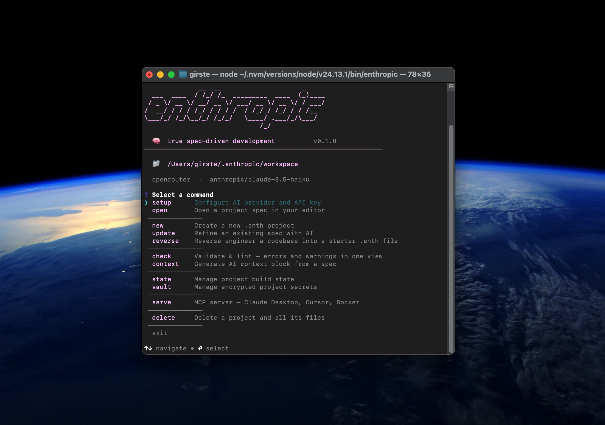
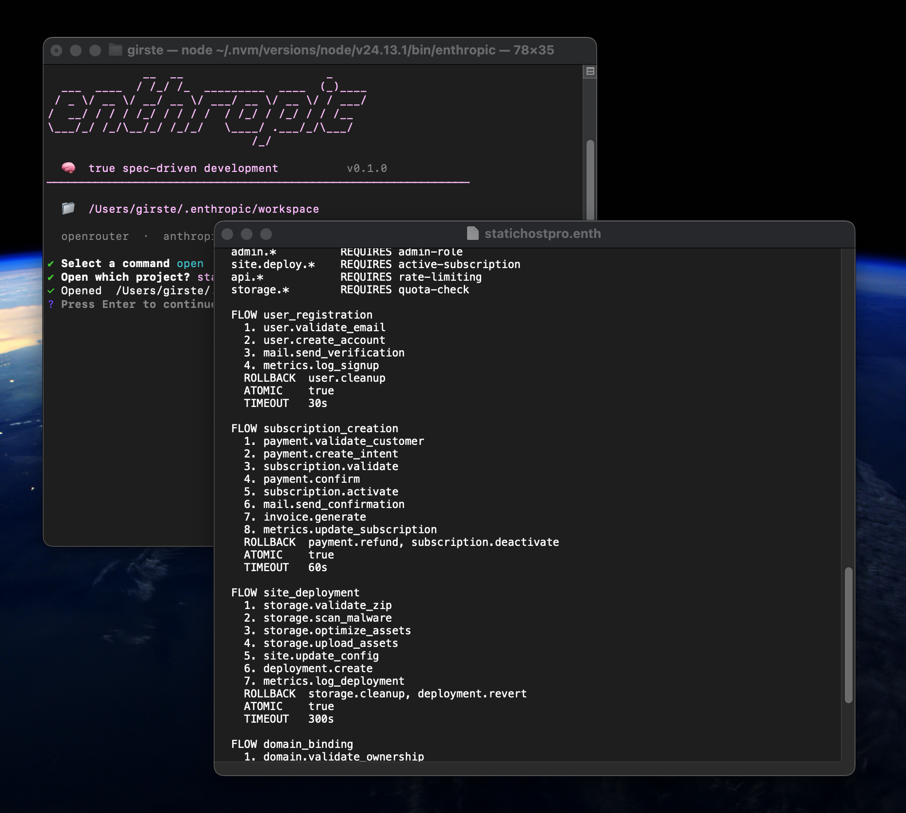

<p align="center">
  
</p>

<p align="center">
  CLI companion for the <a href="https://github.com/enthropic-spec/enthropic">Enthropic</a> spec format.
</p>

<p align="center">
  <a href="https://www.npmjs.com/package/enthropic"></a>
</p>

<p align="center">
  <a href="https://github.com/enthropic-spec/enthropic-tools/actions/workflows/ci.yml"></a>
  <a href="https://github.com/enthropic-spec/enthropic-tools/actions/workflows/lint.yml"></a>
  <a href="https://github.com/enthropic-spec/enthropic-tools/actions/workflows/codeql.yml"></a>
  <a href="https://github.com/enthropic-spec/enthropic-tools/actions/workflows/security-scan.yml"></a>
  <a href="https://securityscorecards.dev/viewer/?uri=github.com/Enthropic-spec/enthropic-tools"></a>
  <a href="https://slsa.dev"></a>
</p>

---

A `.enth` file is the architectural contract of your project — entities, constraints, layer boundaries, naming conventions. Write it once. Every AI session reads it before touching a single line of code.

The CLI validates your spec, tracks build progress, and produces the context block you paste into any AI assistant. Have an existing codebase? `enthropic reverse` reads it and generates a starter spec.

<details>
<summary>Example <code>.enth</code></summary>

```
VERSION 1.0.0

PROJECT "my-api"
  LANG    python
  STACK   fastapi, postgresql, redis
  ARCH    layered

ENTITY user, session, order

LAYERS
  API
    CALLS SERVICE
  SERVICE
    CALLS STORAGE
  STORAGE

CONTRACTS
  user.password NEVER plaintext
  admin.*       REQUIRES verified-auth
```

</details>

## Install

<p align="center">
  <a href="https://www.npmjs.com/package/enthropic">
    
  </a>
</p>

Requires Node.js 20+. No telemetry.

<p align="center">
  
  <br/>
  
</p>

## Commands

| Command | |
|---|---|
| `enthropic setup` | configure AI provider, API key, model |
| `enthropic new` | guided project creation |
| `enthropic build [file]` | AI conversation to design the spec |
| `enthropic update [file]` | refine an existing spec with AI |
| `enthropic reverse [dir]` | *(beta)* reverse-engineer a codebase into a starter spec |
| `enthropic open` | open a project in `$EDITOR` |
| `enthropic check [file]` | validate + lint — errors and warnings grouped by severity |
| `enthropic context [file]` | spec + state → AI context block |
| `enthropic state show [file]` | show build progress |
| `enthropic state set <entity> <status> [file]` | update entity status |
| `enthropic delete` | delete a project |

`[file]` defaults to the `.enth` file in `~/.enthropic/workspace/<project>/`.

## Generated files

`enthropic check` on a valid spec creates:

**`state_[name].enth`** — build progress, updated as you work.

```
STATE myapp

  ENTITY
    user              PENDING
    session           PENDING
    order             PENDING

  LAYERS
    API               PENDING
    SERVICE           PENDING
    STORAGE           PENDING
```

## Roadmap

| | |
|---|---|
| v0.1 ✅ | Parser, validator, check, context, new, build, update, reverse, state, setup, open/delete, SLSA Level 3 |
| v0.2 ✅ | `npm install -g enthropic`, automated release pipeline, npm provenance |
| v0.3 | `DECISIONS` block — architectural choices with rationale. Richer `CONTRACTS` operators |
| v0.4 | Public spec registry + GitHub Action for `enthropic check` in CI |
| v0.5 | Stack-aware security patterns injected automatically in `context` |

## Spec

The `.enth` format is defined in [enthropic/SPEC.md](https://github.com/Enthropic-spec/enthropic/blob/main/SPEC.md).

---

<p align="center">
  <a href="LICENSE"></a>
  &nbsp;
  <a href="https://nodejs.org"></a>
  &nbsp;
  <a href="https://www.npmjs.com/package/enthropic"></a>
</p>
