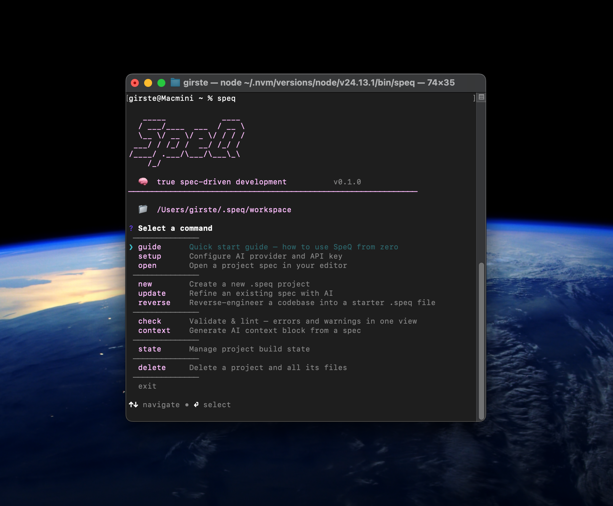
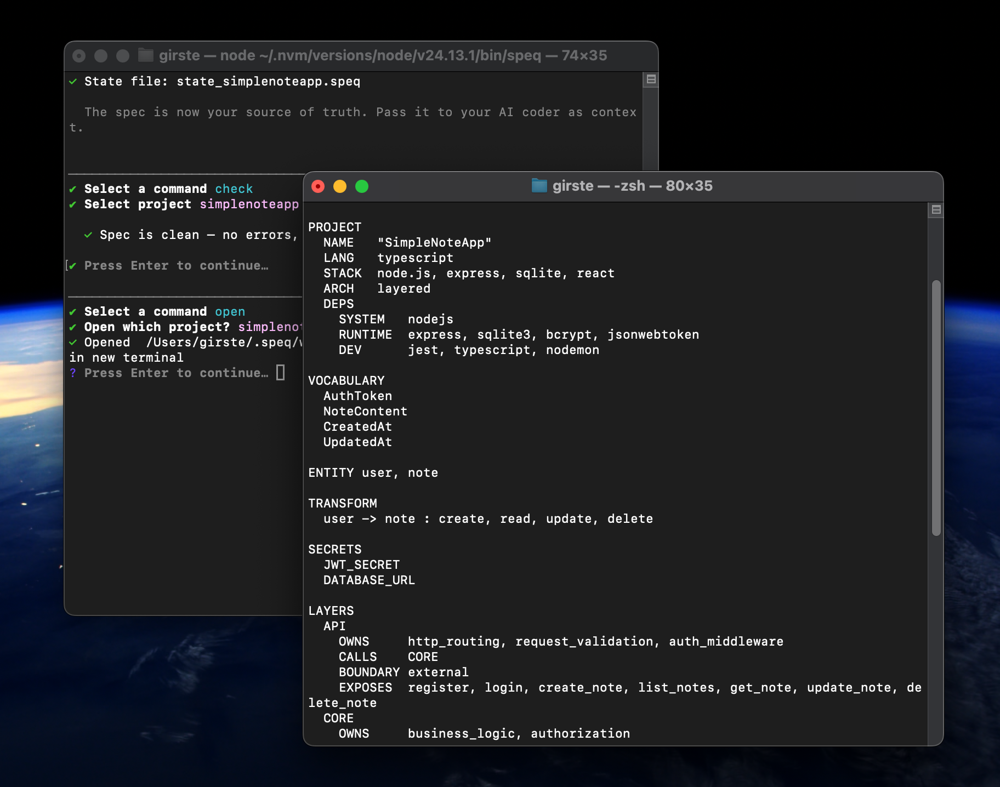

<p align="center">
  
</p>

<p align="center">
  <a href="https://github.com/speq-ai/speq-tools/actions/workflows/ci.yml"></a>
  <a href="https://github.com/speq-ai/speq-tools/actions/workflows/lint.yml"></a>
  <a href="https://github.com/speq-ai/speq-tools/actions/workflows/codeql.yml"></a>
  <a href="https://github.com/speq-ai/speq-tools/actions/workflows/security-scan.yml"></a>
  <a href="https://securityscorecards.dev/viewer/?uri=github.com/speq-ai/speq-tools"></a>
  <a href="https://slsa.dev"></a>
</p>

<p align="center">
  CLI companion for the <a href="https://github.com/speq-ai/speq">SpeQ</a> spec format.
</p>

---

A `.speq` file is the architectural contract of your project. Entities, constraints, layer boundaries, naming conventions. Write it once. Every AI session reads it before touching a single line of code.

The CLI validates your spec, tracks build progress, and produces the context block you paste into any AI assistant. Have an existing codebase? `speq reverse` reads it and generates a starter spec.

## Install

<p align="center">
  <a href="https://www.npmjs.com/package/@speq-ai/speq">
    
  </a>
</p>

```sh
npm install -g @speq-ai/speq
```

Requires Node.js 20+. No telemetry.

<p align="center">
  
  <br/>
  
</p>

## Commands

All commands are also available interactively - just run `speq`.

| Command | Description |
|---|---|
| `speq guide` | quick start guide for new users |
| `speq new` | create a new `.speq` spec with AI |
| `speq update [file]` | refine an existing spec with AI |
| `speq check [file]` | validate + lint, errors and warnings grouped by severity |
| `speq context [file]` | generate the AI context block from your spec and state |
| `speq state show [file]` | show build progress *(automation in progress)* |
| `speq state set <entity> <status> [file]` | update entity status *(automation in progress)* |
| `speq reverse [dir]` | reverse-engineer a codebase into a starter spec *(in development)* |
| `speq open` | open a project in `$EDITOR` |
| `speq delete` | delete a project |
| `speq setup` | configure AI provider, API key, and model |

`[file]` defaults to the `.speq` file in `~/.speq/workspace/<project>/`.

## Generated files

`speq check` on a valid spec creates:

**`state_[name].speq`** - build progress, updated as you work.

```
STATE myapp

  ENTITY
    user              PENDING
    session           PENDING
    order             PENDING

  LAYERS
    API               PENDING
    SERVICE           PENDING
    STORAGE           PENDING
```

---

<p align="center">
  <a href="LICENSE"></a>
  &nbsp;
  <a href="https://nodejs.org"></a>
  &nbsp;
  <a href="https://www.npmjs.com/package/@speq-ai/speq"></a>
</p>
